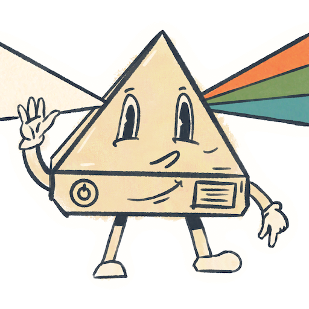

<div align="center">
  

  <h1>Skal jeg på ski?</h1>

  <p>A tiny Danish countdown for the next ski trip.</p>

  <p>
    <a href="https://skaljegpaski.dk"><strong>Open website ↗</strong></a>
  </p>

  <p>
    
    
    
    
  </p>
</div>

## 01 · About

Should I go skiing? The answer is always **JA**.

Pick a departure date and time to start a live countdown. The site adds the date to the URL for sharing and saves it in your browser for the next visit.

## 02 · Features

- Live countdown in Danish
- Shareable dates through the `date` URL parameter
- Local date persistence using `localStorage`
- Native device sharing with a clipboard fallback
- Responsive, dependency-free HTML, CSS, and JavaScript

## 03 · Run locally

No dependencies. No build step.

```bash
git clone git@github.com:lucasfth/skaljegpaski.dk.git
cd skaljegpaski.dk
python3 -m http.server 8000
```

Open [http://localhost:8000](http://localhost:8000).

## 04 · License

Licensed under the [MIT License](./LICENSE).
